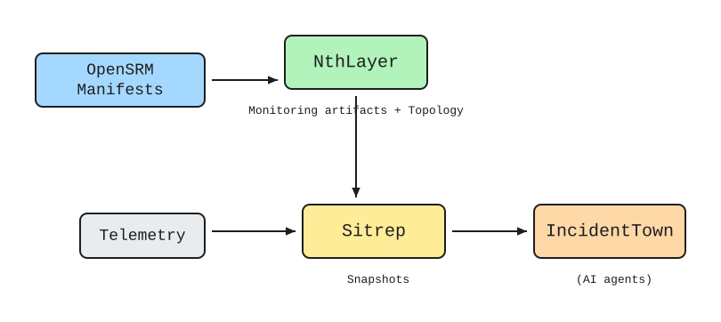

# OpenSRM Ecosystem Components

Components that implement, extend, or consume the OpenSRM specification.

## Component Status

| Component | Purpose | Status | Location |
|-----------|---------|--------|----------|
| [NthLayer](https://github.com/rsionnach/nthlayer) | Reference implementation -- validation, Prometheus rules, Grafana dashboards | Partial | External repo |
| [Sitrep](sitrep/) | Pre-correlation layer for AI-native observability | In design | `components/sitrep/` |
| [Mayday](mayday/) | Multi-agent incident response system | Architecture | `components/mayday/` |

## How Components Fit Together

<picture>
  <source media="(prefers-color-scheme: dark)" srcset="../diagrams/svg/component-flow-dark.svg">
  <source media="(prefers-color-scheme: light)" srcset="../diagrams/svg/component-flow-light.svg">
  
</picture>

See [ARCHITECTURE.md](../ARCHITECTURE.md) for detailed data flows.
